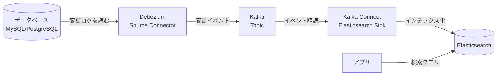

# 全文検索改善のための学習ロードマップ
### Elasticsearch / Kafka / Debezium

> **ゴール**: DBの更新をリアルタイムで検索インデックスに同期し、全文検索を改善できるようになる
> `DB → Debezium → Kafka → Kafka Connect → Elasticsearch`

---

## はじめに — 全体像と学ぶ順番

3つの技術は役割が違います。まずここを理解するのが最重要です。

| 技術 | 役割 | ひとことで言うと |
|------|------|------------------|
| **Elasticsearch** | 検索エンジン本体 | 全文検索を実行・改善する主役 |
| **Kafka** | メッセージ配信基盤 | 変更データを流す「土管」 |
| **Debezium** | CDC（変更データ捕捉） | DBの変更を検知してKafkaに流す「蛇口」 |

### ⚠️ 学び始める前の重要な注意

**いきなり3つ全部を同時に学ばないでください。** 全文検索の改善という本来の目的は、**Elasticsearch単体でほぼ達成できます**。Kafka/Debeziumは「DBとインデックスをリアルタイムで自動同期し続ける」ための仕組みで、これは応用（本番運用）の話です。

まずElasticsearchで検索そのものを改善し、データ同期は最初は簡単な方法（後述）で始め、必要になってからCDCパイプラインに進むのが挫折しない順番です。

---

## 前提知識（着手前にあると良いもの）

- **Docker / Docker Compose** の基本操作（環境構築で必須）
- **REST API と JSON** の読み書き（ElasticsearchはHTTP/JSONで操作する）
- **SQL とDBの基礎**（テーブル、トランザクションの概念）
- **コマンドライン**（curl、ターミナル操作）

不足があれば、まずDockerとcurl/JSONだけ触れておけば十分スタートできます。

---

## フェーズ1：Elasticsearch 基礎（最優先・2〜3週間）

ここが土台です。**全文検索改善の8割はこのフェーズで学べます。**

### 学ぶこと

1. **全文検索の仕組み**
   - 転置インデックス（inverted index）とは何か
   - なぜRDBの `LIKE '%...%'` 検索より速く・賢いのか
2. **環境構築**
   - Docker で Elasticsearch + Kibana を起動
   - Kibana の Dev Tools（Console）でクエリを試す
3. **基本概念**
   - ドキュメント / インデックス / マッピング（mapping）
   - フィールドの型（text と keyword の違いは超重要）
4. **アナライザー（analyzer）** ← 検索品質の核心
   - analyzer = character filter + tokenizer + token filter
   - 文字列がどう分割・正規化されて索引に入るか
5. **CRUD操作**
   - REST APIでドキュメントの登録・取得・更新・削除
   - Bulk API での一括投入
6. **Query DSL（検索クエリ）**
   - `match`（全文検索）と `term`（完全一致）の違い
   - `bool` クエリ（must / should / filter / must_not）の組み立て
7. **関連度スコア리ング**
   - BM25 による並び順の決まり方

### 🇯🇵 日本語検索の必須ポイント

日本語は英語と違い「スペースで単語が区切られない」ため、**専用のアナライザーが必須**です。

- **kuromoji プラグイン**（形態素解析）を必ず導入する
- 形態素解析（意味の単位で分割）と N-gram（文字単位で分割）の使い分け
- ここを飛ばすと日本語検索がまともに動かないので、フェーズ1の中で必ず触れてください

### ハンズオン課題

> サンプルデータ（例：商品カタログや記事）を投入し、kuromojiで日本語全文検索できる状態を作る。`match` と `bool` で「タイトルに"A"を含み、カテゴリが"B"のものを関連度順に」といった検索を書けるようにする。

### 主な教材

- **Elasticsearch 公式ドキュメント（Guide）** — 一次情報。最も正確
- 「Elasticsearch実践ガイド」など日本語の入門書1冊（体系立てて学べる）
- 公式の無料トレーニング「Elasticsearch Engineer」入門動画

---

## フェーズ2：検索の「改善」に踏み込む（2〜3週間）

「使える」から「改善できる」へ。ここが本来の目的に直結します。

### 学ぶこと

1. **アナライザーのチューニング**
   - シノニム（類義語）辞書、ストップワード、ユーザー辞書
   - 表記ゆれ対応（全角/半角、ひらがな/カタカナ）
2. **マッピング設計**
   - multi-field（1フィールドを複数の解析方法で持つ）
   - N-gram による部分一致・サジェスト
3. **関連度チューニング**
   - `boost`、`function_score`、フィールドごとの重み付け
   - なぜこの順位になったかを `explain` で調べる
4. **集計（Aggregations）**
   - ファセット検索（絞り込みUI）の基礎
5. **ハイライト / サジェスト**
   - 検索結果のキーワード強調、オートコンプリート

### 🔎 モダンな検索手法（2026年時点の潮流）

現在のElasticsearchは全文検索に加えて**ベクトル検索・セマンティック検索**が主流になりつつあります。「検索改善」を掲げるなら概要だけでも押さえておくと視野が広がります。

- **kNN / ベクトル検索**：意味の近さで検索する（キーワードが一致しなくてもヒット）
- **セマンティック検索 / ELSER**（Elastic独自の意味検索モデル）
- **ハイブリッド検索**：従来のキーワード検索（BM25）とベクトル検索を組み合わせる

※ これらは応用なので、まずは従来の全文検索を固めてから触れれば十分です。

### ハンズオン課題

> フェーズ1の検索に対し、シノニム辞書と表記ゆれ対応を追加。特定フィールドを重視した重み付けを入れ、「改善前後で検索結果がどう変わるか」を比較できるようにする。

---

## フェーズ2.5：データ同期方式の全体像を知る（1週間・橋渡し）

「検索編（フェーズ1・2）」から「パイプライン編（フェーズ3以降）」への橋渡しフェーズです。CDCは「DBとElasticsearchを同期する」数ある方法の**一つにすぎません**。ここで全体像を掴んでおくと、**「なぜCDCが必要なのか / そもそも本当に必要なのか」を自分で判断できる**ようになり、フェーズ3以降でCDCのありがたみが腹落ちします。

### まず2つの軸で整理する

すべての同期方式は、次の2軸で位置づけられます。

- **軸1：いつ同期するか** — 定期的（バッチ/ポーリング）か、変更のたび（リアルタイム）か
- **軸2：どこで変更を捕まえるか** — アプリのコードで同期するか、DBのログから拾うか（＝これがCDC）

CDCは「**リアルタイム × DB層**」という一点。この対極や中間に、他の方式が並びます。

### 学ぶこと（同期方式のカタログ）

#### ① バッチ再インデックス（定期実行）
定期的（例：1時間ごと、夜間）にDBへSQLを投げて対象データを取得し、ElasticsearchのBulk APIで一括投入する。差分だけ入れたい場合は「更新日時カラム」で前回以降の変更を絞り込む。
- **利点**：仕組みが単純。Kafkaもパイプラインも不要
- **弱点**：同期の遅延が大きい／**削除の検知が苦手**（DBから消えたレコードをESから消しにくい）
- **向くケース**：数分〜数時間の遅延が許される用途。まずはこれで十分なことが多い

#### ② Logstash（JDBC input）などのETLツール
①を専用ツールで実現する方式。LogstashにSQLを設定しておくと、定期的にDBを問い合わせてElasticsearchへ流し込んでくれる。
- **利点**：自前バッチを書かずに済む。間隔を短くすれば準リアルタイムに近づく
- **弱点**：本質はポーリングなので削除検知が弱い／間隔を短くするとDB負荷が増える
- **位置づけ**：①とCDCの中間。「CDCほど作り込みたくないが、自前バッチよりは楽にしたい」とき

#### ③ アプリからの同期二重書き込み（Dual Write）
アプリのコードが、DBに書き込むと同時にElasticsearchにも書き込む。
- **利点**：直感的でリアルタイム性が高い
- **弱点（重要）**：**「二重書き込み問題」**。DBは成功したがES書き込みが失敗した（逆も）場合、両者がズレて整合性が崩れる。ネットワーク瞬断やクラッシュで簡単に起こり得るため、規模が大きくなると危険
- **学びどころ**：この弱点を理解することが、次の④の価値を理解する鍵

#### ④ Transactional Outbox（トランザクショナル・アウトボックス）パターン ★実務の定番
③の整合性問題を解決する、実務で非常によく使われる方式。アプリは本来のデータ更新と**同じDBトランザクションの中で**「outbox（送信箱）テーブル」に変更イベントも書き込む。トランザクションなので「データは更新されたのにイベントが記録されない」ズレが原理的に起きない。その後、別プロセスがoutboxを読んでElasticsearchへ反映し、処理済みの行を消す。
- **利点**：整合性を担保しつつ現実的に運用できる。**③の代わりに選ぶべき定番**
- **面白い点**：outboxを読む部分をポーリング実装すればCDCなしで成立し、DebeziumでoutboxをCDCすれば「Outbox + CDC」のハイブリッドになる（Debeziumには専用機能もある）

#### ⑤ イベント駆動（アプリがメッセージキューにイベントを発行）
アプリがビジネスロジックの中で「商品が更新された」等のドメインイベントをKafka等に発行し、購読するConsumerがElasticsearchへ書き込む。
- **CDCとの違い**：構成図は似ている（Kafka経由）が、**イベントの発生源が違う**。CDCが「DBのログ＝物理的な変更」からイベントを作るのに対し、こちらは「アプリのコード＝ビジネス上の意味」から出す
- **利点／弱点**：意味のある単位でイベント設計できる反面、③同様の発行漏れリスクがある。④のOutboxと組み合わせて信頼性を担保することが多い

#### ⑥（番外）そもそも同期をなくす
Elasticsearchを検索の主データストアとして直接使い、DBとの二重管理自体をやめる考え方。同期の悩みは消えるが、Elasticsearchはトランザクションや厳密な整合性が本業ではないため、一般的なシステムでは非推奨。「そういう割り切りもある」という知識として持っておく程度でよい。

### 同期方式の比較表

| 方式 | いつ同期 | どこで捕捉 | リアルタイム性 | 整合性 | 実装難易度 | 主な弱点 |
|------|:---:|:---:|:---:|:---:|:---:|------|
| ① バッチ再インデックス | 定期 | DBクエリ | 低 | 中 | ★ | 遅延・削除検知が弱い |
| ② Logstash等ETL | 定期〜準RT | DBクエリ | 中 | 中 | ★★ | ポーリング負荷・削除検知 |
| ③ 同期二重書き込み | リアルタイム | アプリ層 | 高 | **低** | ★★ | 二重書き込み問題 |
| ④ Outbox パターン | リアルタイム | アプリ層 | 高 | **高** | ★★★ | outbox処理の実装が必要 |
| ⑤ イベント駆動 | リアルタイム | アプリ層 | 高 | 中〜高 | ★★★ | 発行漏れ対策が必要 |
| ⑥ CDC（Debezium） | リアルタイム | **DB層** | 高 | 高 | ★★★★ | 構成が重い・運用が複雑 |

### CDCの立ち位置（この表からの結論）

**CDCの一番の強みは「アプリのコードを一切変えずに」「DBへの全変更を漏れなく」リアルタイム捕捉できる点。** 逆に言えば、アプリを自由に改修できて更新箇所も限られているなら、④のOutboxで十分なことも多く、CDCの重厚な構成が過剰になる場合がある。

### ハンズオン課題

> 最低でも **①（一番簡単）と④（整合性の考え方が学べる本命）** を手を動かして試す。①でバッチ投入を作り、③の二重書き込みで「片方失敗するとズレる」を体感してから、④のoutboxテーブルでそのズレが消えることを確認する。ここまでやると、フェーズ4でCDCが「何を自動化・解決してくれるのか」がくっきり見える。

### 主な教材

- **microservices.io の Transactional Outbox パターン解説**（④の定番リファレンス）
- **Logstash 公式ドキュメント（JDBC input plugin）**（②を試すとき）
- 「二重書き込み問題（dual write problem）」で検索して事例を読む（③の危険性の理解に有効）

---

## フェーズ3：Kafka 基礎（1〜2週間）

ここからパイプライン編。まずデータを流す土管を理解します。

### 学ぶこと

1. **なぜストリーミング / メッセージキューが必要か**
   - システム間を疎結合にする考え方
2. **中心概念**
   - Broker（サーバー）、Topic（カテゴリ）、Partition（分散の単位）
   - Producer（送る側）、Consumer / Consumer Group（受け取る側）
   - Offset（どこまで読んだかの位置）
3. **KRaft モード**
   - 最近のKafkaは **Zookeeper が不要**（KRaftに移行済み）。古い記事はZookeeper前提のものが多いので注意
4. **Kafka Connect**
   - コードを書かずにデータの入出力を繋ぐフレームワーク
   - Source Connector（入力）と Sink Connector（出力）
   - **これがDebeziumとElasticsearchを繋ぐ土台になる**

### ハンズオン課題

> Docker で Kafka を1台起動し、コンソールから Producer でメッセージを送り、Consumer で受け取る。Topic と Partition、Offset の動きを体感する。

### 主な教材

- **Apache Kafka 公式ドキュメント**（Introduction / Quickstart）
- Confluent の無料学習コンテンツ（Kafka入門として質が高い）

---

## フェーズ4：Debezium と CDC（1〜2週間）

DBの変更を捕まえてKafkaに流す部分です。

### 学ぶこと

1. **CDC（Change Data Capture）とは**
   - ログベースCDC vs ポーリング型の違い
   - なぜログベース（Debezium）が優れているか
2. **Debezium の仕組み**
   - Kafka Connect の **Source Connector** として動く
   - DBのトランザクションログ（MySQLのbinlog / PostgreSQLのWAL）を読む
   - 初回はスナップショット、以降は差分を継続取得
3. **コネクタ設定**
   - MySQL / PostgreSQL コネクタの設定（対象DB側の事前設定も必要）
4. **変更イベントの構造**
   - `before` / `after` / 操作種別（c=作成, u=更新, d=削除）を含むJSON
   - **SMT（Single Message Transform）**、特に `ExtractNewRecordState`（unwrap）で「変更後の状態だけ」を取り出す

### ハンズオン課題

> Docker で DB + Debezium を立て、テーブルを更新したときに Kafka の Topic に変更イベントが流れることを確認する。イベントJSONの中身（before/after）を読めるようにする。

### 主な教材

- **Debezium 公式ドキュメント**（Tutorial が充実）
- Debezium 公式の `debezium-examples` リポジトリ（動くサンプルの宝庫）

---

## フェーズ5：パイプライン統合（1〜2週間）

いよいよ全部を繋ぎます。

### 学ぶこと

1. **Elasticsearch Sink Connector**
   - Kafkaのイベントを Elasticsearch に自動投入する
2. **エンドツーエンド構築**
   - `DB → Debezium → Kafka → Kafka Connect(Sink) → Elasticsearch` を一気通貫で
   - Docker Compose でスタック全体を1コマンド起動
3. **つまずきやすい実務論点**
   - **削除（DELETE）の扱い**：tombstoneイベント → ESからも削除する処理
   - **ドキュメントID の対応付け**：DBの主キーをESのIDに揃える
   - **スキーマ変更（列追加など）への追従**

### ハンズオン課題（このロードマップの集大成）

> DBのレコードを更新・削除したら、数秒以内に Elasticsearch の検索結果に反映される状態を作る。フェーズ2で作った日本語検索を、このパイプラインで自動同期されるインデックスに対して動かす。

---

## フェーズ6：本番運用の勘所（継続的に）

PoC（試作）と本番は別物です。実運用に向けて押さえる点。

- **監視とエラー処理**：Dead Letter Queue（処理失敗イベントの退避）、コネクタの死活監視
- **インデックス運用**：エイリアス（alias）を使った**無停止での再インデックス**、ILM（ライフサイクル管理）
- **整合性**：イベントが重複しても壊れない設計（冪等性 / upsert）
- **スケーリング**：シャード設計、パーティション数の考え方
- **セキュリティ**：認証・TLS・権限管理

---

## 補足：CDCパイプラインは本当に必要か？（過剰設計を避ける）

同期方式の全体像と比較表は **フェーズ2.5** にまとめました。要件次第では、Kafka/Debeziumを使わない方が適切です。

**判断の目安**：
- 数分〜数時間の遅延が許される → **①バッチ**で十分
- リアルタイムが必要で、アプリを自由に改修できる → **④Outbox**が有力
- アプリを触れない／多数のサービスがDBを更新／数秒の遅延も許されない → **⑥CDC**の出番

まずElasticsearch単体 + 簡単な同期で全文検索を改善し、それで足りなければCDCへ。最初からフルパイプラインを組もうとすると、検索改善という本来の目的にたどり着く前に力尽きがちです。

---

## 学習の進め方 5原則

1. **必ず手を動かす** — 各フェーズのハンズオン課題を飛ばさない。読むだけでは身につかない
2. **Docker Compose で環境を使い捨てる** — 壊してもすぐ作り直せる状態にしておく
3. **一次情報（公式ドキュメント）を軸にする** — ブログは古い情報（例：Zookeeper前提）が多い。バージョンを確認する
4. **小さく繋いで確認する** — 「DB→Kafka」だけ、「Kafka→ES」だけ、と分割して動作確認してから全体を繋ぐ
5. **本来の目的を見失わない** — 目的は「全文検索の改善」。パイプラインは手段

---

## バージョンについて（2026年7月時点）

- **Elasticsearch**：9.4系が最新、8.19系も長期サポート中。学習ではどちらの最新版でもOK
- **Kafka**：KRaftモードが標準（Zookeeper不要）。古い手順書に注意
- **Debezium**：最新の安定版を利用。対応DBバージョンは公式の互換性表を確認

※ バージョンは変わるため、着手時に各公式サイトで最新を確認してください。

---

## 想定学習期間の目安

| フェーズ | 内容 | 目安 |
|:---:|------|:---:|
| 1 | Elasticsearch基礎 | 2〜3週間 |
| 2 | 検索の改善 | 2〜3週間 |
| 2.5 | データ同期方式の全体像（橋渡し） | 1週間 |
| 3 | Kafka基礎 | 1〜2週間 |
| 4 | Debezium / CDC | 1〜2週間 |
| 5 | パイプライン統合 | 1〜2週間 |
| 6 | 本番運用 | 継続 |

> 週に数時間のペースで **フェーズ1〜2で約1〜1.5ヶ月、全体で2〜3ヶ月** が一つの目安です。まずはフェーズ1・2を完走して「全文検索を改善できた」という成功体験を作るのがおすすめです。
