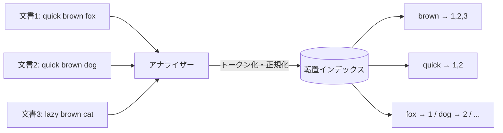

# フェーズ1 第1章：全文検索の仕組み

> Elasticsearch学習教科書 — フェーズ1「Elasticsearch基礎」
> 前提知識：不要（この章から読み始められます）

---

## この章で学ぶこと（学習目標）

この章を読み終えると、次のことが説明できるようになります。

- 「全文検索」とは何か、普通のデータベース検索と何が違うのか
- なぜ `LIKE '%キーワード%'` 検索が遅く、賢くないのか
- **転置インデックス（inverted index）** という仕組みと、その作られ方
- 検索したときに内部で何が起きているのか
- 全文検索エンジンが「速くて賢い」理由

Elasticsearchの機能に入る前に、まず**その土台にある考え方**を押さえます。ここが分かると、この先のマッピングやアナライザーの話が「なぜ必要なのか」まで含めてスッと入ってきます。

---

## 1.1 そもそも「全文検索」とは何か

**全文検索（full-text search）** とは、大量の文章（テキスト）の中から、キーワードを含む文書を高速に探し出す仕組みのことです。

身近な例で言うと、次のようなものはすべて全文検索です。

- ニュースサイトで「地震 東京」と入れて記事を探す
- ECサイトで「軽量 ノートパソコン」と入れて商品を探す
- 社内wikiで「経費 申請 方法」と入れて手順書を探す

ポイントは、**「文章の中身（本文）」を対象に検索する**という点です。IDや価格のような決まった値で絞り込むのではなく、自由に書かれた文章の中からキーワードを探します。

> 📌 **用語**：この教科書では、検索対象となる1件のデータ（1つの記事、1つの商品など）を **文書（document）** と呼びます。Elasticsearchでも同じ言葉を使います。

---

## 1.2 素朴なやり方とその限界 — RDBの `LIKE` 検索

全文検索を「普通のデータベース（RDB）でやろうとすると、どうなるか」から見ていきましょう。ここでの"つらさ"を体感することが、全文検索エンジンの価値を理解する近道です。

たとえば、記事を保存した `articles` テーブルがあるとします。

| id | title | body |
|----|-------|------|
| 1 | 猫の飼い方 | 猫は水を嫌うので… |
| 2 | 犬の散歩 | 犬は毎日散歩が必要… |
| 3 | 猫と犬の違い | 猫は単独行動、犬は群れ… |

「猫」を含む記事を探すとき、SQLではこう書きます。

```sql
SELECT * FROM articles WHERE body LIKE '%猫%';
```

これは動きます。文書が数件ならまったく問題ありません。しかし、文書が数万・数百万件になると、2つの深刻な問題が出てきます。

### 問題① 遅い

`LIKE '%猫%'` の `%`（前後のワイルドカード）は、**通常のインデックス（索引）が効きません**。

RDBのインデックス（B-treeなど）は「田中さん」「田村さん」のように**先頭から順に並べて**高速検索する仕組みです。ところが `%猫%` は「どこかに"猫"が含まれる」という指定なので、先頭が分からず、並べ替えの恩恵を受けられません。

結果として、DBは**全部の行を1件ずつ、本文を頭から末尾までなめて**「猫があるか？」を確認します。これを **フルスキャン（全表走査）** と呼びます。

- 文書が10万件あれば、10万件すべての本文を毎回チェック
- 本文が長ければ、その中の文字も1つずつ照合

つまり、データが増えるほど検索は線形に遅くなります。

### 問題② 賢くない

仮に速度が許せたとしても、`LIKE` には検索品質の問題があります。

- **表記ゆれに弱い**：「猫」で検索しても「ネコ」「ねこ」はヒットしない
- **語形変化に弱い**：英語なら "run" で検索しても "running" "ran" は別物扱い
- **関連度の概念がない**：ヒットするかしないかの「◯×」だけ。「どの記事がより関連が強いか」で並べ替えられない
- **意図しないヒット**：「京都」を探したいのに「東京都」がヒットする（"京都"を部分的に含むため）

検索結果を「関連の強い順」に並べられないのは、実用上とても大きな弱点です。ユーザーが本当に欲しい1件を上位に出せません。

> 💡 **ここまでのまとめ**：RDBの `LIKE` は「小規模なら使えるが、大規模・高品質の全文検索には向かない」。この2つの限界（遅い・賢くない）を解決するのが、次に学ぶ**転置インデックス**です。

---

## 1.3 発想の転換 — 転置インデックス

全文検索エンジンの心臓部が **転置インデックス（inverted index）** です。名前は難しそうですが、発想は驚くほど身近です。

### 本の巻末索引を思い出す

技術書の巻末についている**索引（さくいん）**を思い出してください。

```
【索引】
インデックス …… 12, 45, 78ページ
クエリ      …… 33, 90ページ
転置       …… 12, 45ページ
```

もし索引がなかったら、「"転置"はどこに書いてある？」を調べるのに、**本を1ページ目から最後までめくって探す**しかありません。これがまさに `LIKE` のフルスキャンです。

一方、索引があれば「転置 → 12, 45ページ」と**一発で場所が分かります**。全文検索エンジンは、この巻末索引をコンピュータの中に作っているのです。

### 「順引き」と「逆引き」

普通のデータの持ち方は「文書 → その中の単語」という向きです。これを**順方向のインデックス（forward index）** と呼びます。

```
文書1 → [猫, 水, 嫌う]
文書2 → [犬, 毎日, 散歩]
```

転置インデックスは、この矢印を**逆向き**にします。「単語 → その単語が含まれる文書」という持ち方です。

```
猫 → [文書1, 文書3]
犬 → [文書2, 文書3]
水 → [文書1]
散歩 → [文書2]
```

矢印の向きを"転置（ひっくり返す）"するので、**転置**インデックスと呼ばれます。こうしておけば、「猫を含む文書は？」に対して `猫 → [文書1, 文書3]` と即座に答えられます。1件ずつ本文を調べる必要がありません。

---

## 1.4 転置インデックスの作られ方

では、文章から転置インデックスがどう作られるのかを、具体例で追いかけましょう。次の3つの文書があるとします（分かりやすさのため、単語がスペースで区切られた例を使います）。

```
文書1: quick brown fox
文書2: quick brown dog
文書3: lazy brown cat
```

### ステップ1：文章を単語に分解する（トークン化）

まず各文書を**単語（トークン）** に切り分けます。この処理を **トークン化（tokenization）** と呼びます。

```
文書1 → [quick] [brown] [fox]
文書2 → [quick] [brown] [dog]
文書3 → [lazy]  [brown] [cat]
```

### ステップ2：単語を正規化する

次に、単語を検索しやすい形に**そろえます（正規化）**。たとえば「大文字を小文字に統一する」などです。今回はすべて小文字なのでそのままですが、`Brown` があれば `brown` に変換します。

> この「トークン化 → 正規化」を行う部品を **アナライザー（analyzer）** と呼びます。アナライザーは全文検索の品質を左右する最重要パーツで、**フェーズ1の後半で本格的に学びます**。特に日本語は単語がスペースで区切られないため、専用の仕組み（形態素解析）が必要になります（→ 第4章で詳述）。

### ステップ3：単語ごとに文書番号をまとめる（転置）

正規化した単語ごとに、「どの文書に出てきたか」をまとめます。これで転置インデックスが完成します。

| 単語（Term） | 出現する文書（Postings） |
|-------------|--------------------------|
| brown | 文書1, 文書2, 文書3 |
| quick | 文書1, 文書2 |
| fox | 文書1 |
| dog | 文書2 |
| lazy | 文書3 |
| cat | 文書3 |

この「単語 → 文書リスト」の各行を **ポスティングリスト（posting list）** と呼びます。実際のElasticsearchでは、ここに「その文書のどの位置に出たか」「何回出たか」といった情報も一緒に記録されます（位置情報はフレーズ検索に、出現回数は関連度スコアに使われます）。



---

## 1.5 検索したときに何が起きるか

転置インデックスができていれば、検索は一瞬です。「`quick brown` を含む文書を探す」という検索を例に、内部の動きを追います。

### ステップ1：検索キーワードも同じように分解・正規化する

ここが重要なポイントです。**検索キーワードも、文書を索引化したときと同じアナライザーで処理されます。**

```
"quick brown" → [quick] [brown]
```

文書側とクエリ側で同じ処理をするからこそ、正しく突き合わせができます。（この「両側で同じアナライザーを使う」という原則は、後の章で何度も出てきます。）

### ステップ2：転置インデックスを引く

分解した各単語のポスティングリストを引きます。

```
quick → [文書1, 文書2]
brown → [文書1, 文書2, 文書3]
```

### ステップ3：リストを突き合わせる

「`quick` **かつ** `brown` を含む文書」を探すなら、2つのリストの**共通部分（AND）** を取ります。

```
[文書1, 文書2] ∩ [文書1, 文書2, 文書3] = [文書1, 文書2]
```

→ 答えは **文書1 と 文書2**。本文を1件も読み直すことなく、リストの照合だけで答えが出ました。

「`quick` **または** `brown`」なら和集合（OR）を取ります。全文検索エンジンは、この AND / OR / NOT の組み合わせ（ブールクエリ）を高速に処理できます。これはフェーズ1後半の `bool` クエリで実際に書けるようになります。

---

## 1.6 なぜ速いのか — 計算量で比べる

`LIKE` と転置インデックスの違いを、ざっくりした計算量で比べてみます。

| | RDBの `LIKE '%猫%'` | 転置インデックス |
|--|--|--|
| やること | 全文書の本文を頭から照合 | 単語を鍵に索引を1回引く |
| 文書が増えると | 比例して遅くなる（全件走査） | ほぼ影響を受けない |
| イメージ | 図書館で全部の本をめくる | 巻末索引で該当ページに直行 |

転置インデックスでは、検索キーワードから**該当するポスティングリストへ直接ジャンプ**できます。文書が10万件でも100万件でも、「猫」のリストを引く手間は大きく変わりません。ここが、大規模データでも高速を保てる理由です。

---

## 1.7 なぜ賢いのか — 正規化と関連度

速さだけではありません。全文検索エンジンは検索の**品質**でも `LIKE` を大きく上回ります。理由は2つあります。

### 理由① 索引を作る段階で正規化しているから

`LIKE` は文字をそのまま照合するだけですが、全文検索エンジンは**索引を作る時点で単語をそろえて**います。この正規化を工夫することで、次のようなことが可能になります（具体的な設定はフェーズ1・2で学びます）。

- 大文字小文字を無視する（`Apple` と `apple` を同一視）
- 表記ゆれを吸収する（「猫」「ネコ」「ねこ」をそろえる）
- 類義語を同一視する（「PC」と「パソコン」をヒットさせる）
- 語形の違いを吸収する（英語の "running" を "run" に戻す＝ステミング）

`LIKE` では実現が難しいこれらが、全文検索では標準的に扱えます。

### 理由② 関連度スコアで並べ替えられるから

全文検索エンジンは、ヒットした各文書に **関連度スコア（relevance score）** という点数をつけ、**点数の高い順に並べて**返します。

スコアは、おおまかに次のような考え方で計算されます（Elasticsearchでは **BM25** というアルゴリズムが使われます。詳細はフェーズ1後半で学びます）。

- 検索語が**その文書に何回出てくるか**（多いほど関連が強そう）
- 検索語が**全文書の中でどれくらい珍しいか**（珍しい語で一致するほど価値が高い）
- 文書の**長さ**（短い文書での一致のほうが密度が高い）

これにより、「ユーザーが本当に欲しい1件」を上位に出せます。`LIKE` の「◯か×か」だけの世界とは、検索体験がまるで変わります。

---

## 1.8 まとめ：RDB検索 vs 全文検索エンジン

この章の内容を一枚の表にまとめます。

| 観点 | RDBの `LIKE '%…%'` | 全文検索エンジン（転置インデックス） |
|------|--------------------|--------------------------------------|
| 仕組み | 本文を1件ずつ走査 | 単語→文書の索引を引く |
| 速度（大規模） | 遅い（全件走査） | 速い（索引で直行） |
| 表記ゆれ・類義語 | 弱い | 正規化で対応できる |
| 語形変化 | 弱い | ステミング等で対応できる |
| 関連度順の並べ替え | できない | スコアで並べられる |
| 向いている用途 | 完全一致・小規模 | 大規模・高品質な全文検索 |

**全文検索エンジンが速くて賢い理由は、「検索の瞬間にがんばる」のではなく、「あらかじめ転置インデックスという索引を作り込んでおく」から** です。この"前処理でがんばる"という発想が、Elasticsearch全体を貫く基本思想です。

---

## 1.9 理解度チェック

学んだことを確認しましょう（解答は下にあります）。

**問1.** `LIKE '%猫%'` が大規模データで遅くなる理由を、「インデックス」という言葉を使って説明してください。

**問2.** 「順方向インデックス」と「転置インデックス」は、それぞれどの向きの対応を持っていますか？

**問3.** 次の3文書から転置インデックス（単語→文書番号）を作ってください。
```
文書1: apple banana
文書2: banana cherry
文書3: apple cherry
```
そのうえで、「`apple` **かつ** `cherry`」を含む文書はどれか答えてください。

**問4.** 全文検索エンジンが `LIKE` より「賢い」と言える理由を、2つ挙げてください。

<details>
<summary>解答を見る</summary>

**問1.** `LIKE '%猫%'` は前後にワイルドカードがあるため、先頭から並べて高速検索するB-treeインデックスが効かない。そのため全文書の本文を1件ずつ頭から照合するフルスキャンになり、データ量に比例して遅くなる。

**問2.**
- 順方向インデックス：文書 → その中に含まれる単語
- 転置インデックス：単語 → その単語を含む文書

**問3.**
| 単語 | 文書 |
|------|------|
| apple | 1, 3 |
| banana | 1, 2 |
| cherry | 2, 3 |

`apple`（=1,3）かつ `cherry`（=2,3）の共通部分は **文書3**。

**問4.**（以下から2つ）
- 索引作成時に正規化するため、表記ゆれ・大文字小文字・類義語・語形変化を吸収できる
- 関連度スコアをつけて、関連の強い順に並べ替えて返せる

</details>

---

## 次の章へ

次章では、この転置インデックスを実際に持っているソフトウェア、**Elasticsearch そのもの**の環境構築に進みます。DockerでElasticsearchとKibanaを起動し、この章で学んだ「単語→文書」の索引が本当に作られる様子を、自分の手で確認していきます。

> **次章：フェーズ1 第2章「環境構築 — DockerでElasticsearch/Kibanaを動かす」**

---

### この章のキーワード

全文検索 / 文書（document）/ フルスキャン / 転置インデックス（inverted index）/ 順方向インデックス / トークン化 / 正規化 / アナライザー / ポスティングリスト / 関連度スコア / BM25
