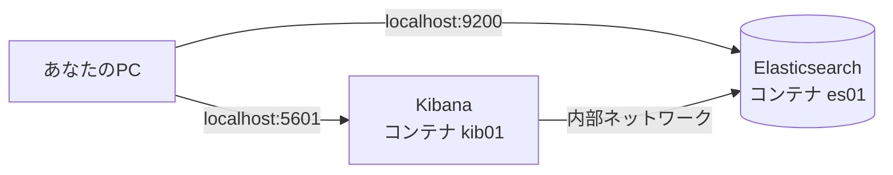

# フェーズ1 第2章：環境構築 — DockerでElasticsearch/Kibanaを動かす

> Elasticsearch学習教科書 — フェーズ1「Elasticsearch基礎」
> 前提知識：第1章（全文検索の仕組み）／Dockerがインストール済みであること

---

## この章で学ぶこと（学習目標）

この章を読み終えると、次のことができるようになります。

- Docker Compose を使って **Elasticsearch と Kibana を1コマンドで起動** できる
- Elasticsearch が動いていることを **REST API（curl）で確認** できる
- Kibana の **Dev Tools（Console）** からクエリを打てる
- 第1章で学んだ **トークン化（転置インデックスの入口）を自分の目で確認** できる
- 環境を **停止・削除して作り直せる**（＝使い捨てられる）

第1章では「全文検索は転置インデックスという索引で動く」という仕組みを学びました。この章では、その転置インデックスを実際に持つソフトウェア＝Elasticsearchを、自分のPC上で動かします。

---

## 2.1 なぜDockerで動かすのか

Elasticsearchは本来、Javaの実行環境を整えたり設定ファイルを書いたりと、インストールに手間がかかります。**Docker** を使うと、それらが全部パッケージ化された状態で、コマンド一つで起動できます。

学習用途でDockerを使う利点は特に大きく、次の3つが効いてきます。

- **環境を汚さない**：PCに直接インストールしないので、後片付けが簡単
- **再現性がある**：同じ設定ファイルなら、誰のPCでも同じ環境が立ち上がる
- **使い捨てられる**：壊れても消して作り直すだけ。実験し放題

さらに Elasticsearch は単体でなく、**Kibana** という管理・可視化ツールと一緒に使うのが定番です。Docker Compose を使えば、この2つをまとめて起動できます。

> 📌 **用語**：**Kibana** は、Elasticsearchをブラウザから操作・可視化するためのツールです。この教科書では主に、Kibana内の **Dev Tools（Console）** という「クエリを書いて実行する画面」を使っていきます。

---

## 2.2 事前準備

### Docker のインストール

Docker がまだない場合は、公式サイトから **Docker Desktop**（Mac / Windows）または Docker Engine（Linux）をインストールしてください。インストール後、ターミナルで次を実行してバージョンが表示されればOKです。

```bash
docker --version
docker compose version
```

> ⚠️ 新しいDockerでは `docker compose`（スペース区切り）が標準です。古い記事にある `docker-compose`（ハイフン）は旧形式です。この教科書ではスペース区切りで統一します。

### メモリの割り当て

Elasticsearch はメモリを使います。**Docker Desktop の設定でメモリを最低4GB以上**（できれば6GB以上）割り当ててください。
（Docker Desktop → Settings → Resources → Memory）

### Linuxユーザーのみ：カーネル設定

Linux（Docker Desktopを使わない場合）では、Elasticsearchが要求する仮想メモリ設定を上げておく必要があります。

```bash
sudo sysctl -w vm.max_map_count=262144
```

（Mac / Windows の Docker Desktop 利用時は通常不要です。もし起動時に `max_map_count` 関連のエラーが出たら、この章末のトラブルシューティングを参照してください。）

---

## 2.3 いちばん速い方法（参考）：公式クイックスタート

Elastic は、ローカル開発用にワンコマンドでElasticsearch + Kibanaを立ち上げる公式スクリプトを提供しています。「とにかく一瞬で触りたい」ならこれが最速です。

ただし本教科書では、**中身が見えて・設定を理解でき・使い捨てやすい** Docker Compose 方式を本命として進めます（次節）。クイックスタートの最新の実行コマンドは、公式ドキュメントの「Local development installation (quickstart)」ページで確認してください。

---

## 2.4 本命：Docker Compose で構築する

### ステップ1：作業フォルダと設定ファイルを用意する

好きな場所に作業フォルダを作り、その中に `docker-compose.yml` という名前で次の内容を保存します。

```yaml
services:
  # --- 検索エンジン本体 ---
  elasticsearch:
    image: docker.elastic.co/elasticsearch/elasticsearch:9.4.3
    container_name: es01
    environment:
      - discovery.type=single-node          # 1台構成で動かす
      - xpack.security.enabled=false         # 学習用にログイン/TLSを無効化
      - "ES_JAVA_OPTS=-Xms1g -Xmx1g"         # メモリ割当（1GB）
    ports:
      - "9200:9200"                          # REST APIの入り口
    ulimits:
      memlock:
        soft: -1
        hard: -1

  # --- 可視化・操作ツール ---
  kibana:
    image: docker.elastic.co/kibana/kibana:9.4.3
    container_name: kib01
    environment:
      - ELASTICSEARCH_HOSTS=http://elasticsearch:9200
    ports:
      - "5601:5601"                          # ブラウザでアクセスする画面
    depends_on:
      - elasticsearch
```

### ステップ2：設定の意味を1行ずつ理解する

コピペで動きますが、**何をしているか**を押さえておくと後で応用が効きます。

| 設定 | 意味 |
|------|------|
| `image: ...elasticsearch:9.4.3` | 使うElasticsearchのバージョン。数字を固定しておくと再現性が保てる |
| `discovery.type=single-node` | 「1台だけのクラスタ」として起動する（本番の多重化チェックを省略） |
| `xpack.security.enabled=false` | ログイン認証とTLS暗号化を**無効化**。学習に集中するための割り切り |
| `ES_JAVA_OPTS=-Xms1g -Xmx1g` | Elasticsearchが使うメモリ量（ここでは1GB） |
| `ports: 9200:9200` | ElasticsearchのREST APIをPC側のポート9200に繋ぐ |
| `ports: 5601:5601` | KibanaのWeb画面をPC側のポート5601に繋ぐ |
| `depends_on: elasticsearch` | Elasticsearchが立ってからKibanaを起動する |

> ⚠️ **重要な注意**：ここでは学習をスムーズにするため `xpack.security.enabled=false` でセキュリティを切っています。Elasticsearchは本来、バージョン8以降**セキュリティが既定でON**（パスワード＋TLS）です。**この構成はローカル学習専用**であり、本番や外部公開環境では絶対に使わないでください。セキュリティの正しい設定はフェーズ6で扱います。

### ステップ3：起動する

`docker-compose.yml` を置いたフォルダで、次を実行します。

```bash
docker compose up -d
```

`-d` は「バックグラウンドで起動」の意味です。初回はイメージのダウンロードが走るため、数分かかることがあります。

起動状況は次で確認できます。

```bash
docker compose ps
```

`es01` と `kib01` の2つが `running`（または `healthy`）になっていれば成功です。



---

## 2.5 動作確認

### Elasticsearch を確認する（curl）

ターミナルで次を実行します。

```bash
curl http://localhost:9200
```

次のような JSON が返ってくれば、Elasticsearch が動いています（バージョン番号などは環境により異なります）。

```json
{
  "name" : "es01",
  "cluster_name" : "docker-cluster",
  "version" : {
    "number" : "9.4.3",
    ...
  },
  "tagline" : "You Know, for Search"
}
```

最後の `"You Know, for Search"` は Elasticsearch のキャッチフレーズです。これが見えたら接続成功のサインです。

クラスタの健康状態も見てみましょう。

```bash
curl "http://localhost:9200/_cat/health?v"
```

`status` が `green` か `yellow` なら問題ありません（1台構成では、レプリカが割り当てられないため `yellow` が正常です。詳細はフェーズ6で扱います）。

### Kibana を確認する（ブラウザ）

ブラウザで次にアクセスします。

```
http://localhost:5601
```

Kibana の画面が表示されれば成功です（初回は起動完了まで1〜2分待つことがあります）。

次に、この教科書で多用する **Dev Tools** を開きます。

1. 左上のメニュー（≡）を開く
2. 下の方の **Management → Dev Tools** を選ぶ

左側にクエリを書いて、緑の再生ボタン（▶）で実行し、右側に結果が出る画面です。ここが、これからの学習の"実験台"になります。

まず接続確認として、Console に次を入力して実行してみましょう。

```
GET /
```

先ほどcurlで見たのと同じ情報が右側に表示されればOKです。

---

## 2.6 第1章の「転置インデックス」を、自分の目で確認する

環境ができたので、第1章で学んだ内容を**実際に動かして確かめて**みましょう。ここが、この章のいちばん面白いところです。

### トークン化を見てみる（_analyze API）

第1章で「文章はアナライザーによってトークン（単語）に分解され、それが転置インデックスに入る」と学びました。その**トークン化の瞬間**を見られる `_analyze` というAPIがあります。

Kibana の Dev Tools に次を入力して実行してください。

```
POST /_analyze
{
  "analyzer": "standard",
  "text": "quick brown fox"
}
```

すると、次のような結果が返ります（抜粋）。

```json
{
  "tokens": [
    { "token": "quick", "position": 0 },
    { "token": "brown", "position": 1 },
    { "token": "fox",   "position": 2 }
  ]
}
```

第1章で紙の上でやった「`quick brown fox` → `[quick] [brown] [fox]`」という分解が、**Elasticsearchの中で本当に行われている**のが確認できました。この分解された単語こそが、転置インデックスの「単語（Term）」になります。

### 日本語を入れてみる（重要な気づき）

では、日本語で同じことをしてみましょう。

```
POST /_analyze
{
  "analyzer": "standard",
  "text": "私は猫が好きです"
}
```

結果を見ると、`私`, `は`, `猫`… のように**1文字ずつバラバラ**に分割されてしまうはずです。これは標準のアナライザーが日本語の「単語の区切り」を理解できないためです。

> 💡 **これが第4章への伏線です**：第1章で触れたとおり、日本語は単語がスペースで区切られないため、専用のアナライザー（**kuromoji** による形態素解析）が必要になります。それを入れると「私 / 猫 / 好き」のように意味の単位で分割できるようになります。日本語検索の品質は、ここで決まります。**フェーズ1 第4章「アナライザー」で本格的に学びます。**

### ついでに：初めての検索を体験する

環境が動いている記念に、1件だけ文書を入れて検索してみましょう（各APIの詳しい意味は第3章以降で学ぶので、いまは「動いた！」を味わうだけでOKです）。

文書を1件登録する:

```
PUT /my-first-index/_doc/1
{
  "title": "はじめてのElasticsearch",
  "body": "quick brown fox"
}
```

`"result": "created"` が返れば登録成功です。次に検索します。

```
GET /my-first-index/_search
{
  "query": {
    "match": { "body": "fox" }
  }
}
```

`hits` の中に、先ほど登録した文書が返ってくれば成功です。第1章で学んだ「`fox` → その語を含む文書」という転置インデックスの引き当てが、まさに動いています。

---

## 2.7 環境の停止・削除（使い捨てる）

学習を終えたら、あるいは環境を作り直したくなったら、次のコマンドで操作します。

**一時停止（データは残す）**：
```bash
docker compose stop
```
再開するときは `docker compose start`。

**完全に削除する（コンテナを消す）**：
```bash
docker compose down
```

**データごと完全リセットする**（実験で汚したインデックスも全部消す）：
```bash
docker compose down -v
```

この「いつでも消して作り直せる」状態こそ、Dockerで学習する最大の利点です。**壊すことを恐れず、どんどん実験してください。**

---

## 2.8 トラブルシューティング

| 症状 | 原因と対処 |
|------|-----------|
| コンテナがすぐ落ちる／`max_map_count` エラー | Linuxで `sudo sysctl -w vm.max_map_count=262144` を実行。Docker Desktopならメモリ割当を増やす |
| Kibanaが「Kibana server is not ready yet」のまま | Elasticsearchの起動待ち。1〜2分待って再読み込み。それでもダメならログを確認：`docker compose logs kibana` |
| `curl localhost:9200` が繋がらない | 起動直後で未完了の可能性。`docker compose ps` で状態確認。ポート9200が他で使われていないか確認 |
| メモリ不足で不安定 | `ES_JAVA_OPTS` の `1g` を、割当メモリに応じて調整。Docker Desktopの割当も見直す |
| ログ全体を見たい | `docker compose logs -f`（`-f` で追従表示、Ctrl+Cで終了） |

---

## 2.9 まとめ

- **Docker Compose** を使えば、Elasticsearch と Kibana を1コマンド（`docker compose up -d`）で起動できる
- 動作確認は、**curl（`localhost:9200`）** と **Kibanaの Dev Tools（`localhost:5601`）** の2通り
- 学習用途では割り切って**セキュリティを無効化**したが、本番では既定でONであることを忘れない
- `_analyze` APIを使うと、第1章で学んだ**トークン化を実際に目で確認**できる
- 標準アナライザーは**日本語を1文字ずつに割ってしまう** → 第4章のkuromojiへの伏線
- 環境は `docker compose down -v` で**いつでも作り直せる**。壊すことを恐れない

これで、これからの全学習の"実験台"が整いました。

---

## 2.10 理解度チェック

**問1.** 学習用に `xpack.security.enabled=false` を設定しました。これは何を無効化していますか？また、なぜ本番では使ってはいけないのですか？

**問2.** Elasticsearch が動いていることを、ターミナルから確認するコマンドは何ですか？

**問3.** `_analyze` APIで `"text": "私は猫が好きです"` を標準アナライザーにかけると、なぜ意図どおりに単語分割されないのでしょうか。第1章の内容を踏まえて説明してください。

**問4.** 実験でインデックスを汚してしまい、まっさらな状態に戻したいとき、どのコマンドを使いますか？

<details>
<summary>解答を見る</summary>

**問1.** ログイン認証（パスワード）とTLS通信の暗号化を無効化している。誰でもアクセスできてしまう危険な状態のため、本番や外部からアクセスできる環境では絶対に使ってはいけない。学習用にローカルで閉じて使う前提での割り切り。

**問2.** `curl http://localhost:9200`（`"You Know, for Search"` が返れば成功）。

**問3.** 標準（standard）アナライザーは、日本語の「単語の区切り」を理解できないため。日本語は英語と違ってスペースで単語が区切られておらず、意味の単位で分割するには形態素解析（kuromoji）などの専用アナライザーが必要になる（第4章で学ぶ）。

**問4.** `docker compose down -v`（`-v` でデータ（ボリューム）ごと削除し、再度 `up -d` すればまっさらな状態になる）。

</details>

---

## 次の章へ

環境と実験台が整いました。次章からは、いよいよElasticsearchの基本操作に入ります。**「ドキュメント」「インデックス」「マッピング」** という3つの基本概念を学び、データを登録・取得・更新・削除（CRUD）できるようになります。第1章の「文書」「単語の型」の話が、ここで具体的なAPI操作として立ち上がってきます。

> **次章：フェーズ1 第3章「基本概念 — ドキュメント・インデックス・マッピング」**

---

### この章のキーワード

Docker / Docker Compose / Kibana / Dev Tools / REST API / ポート9200・5601 / single-node / xpack.security / `_analyze` API / curl / 使い捨て環境
