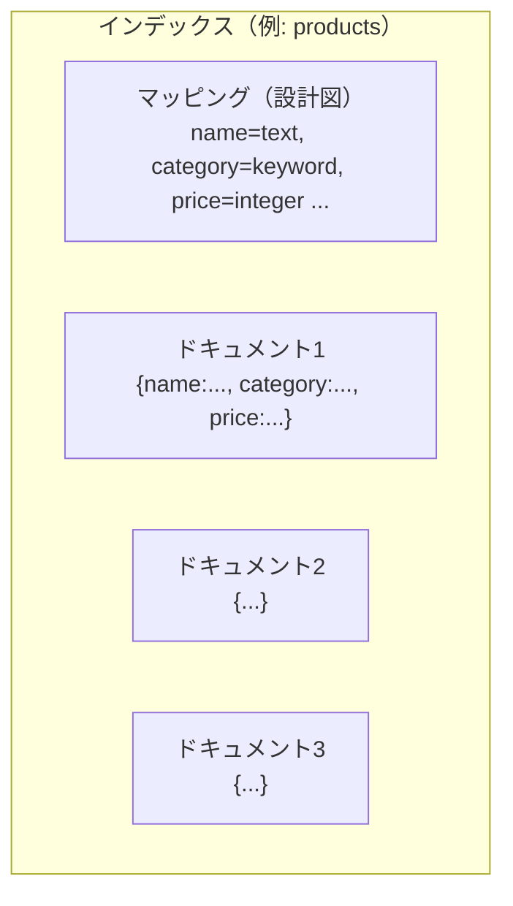

# フェーズ1 第3章：基本概念 — ドキュメント・インデックス・マッピング

> Elasticsearch学習教科書 — フェーズ1「Elasticsearch基礎」
> 前提知識：第1章（全文検索の仕組み）／第2章（環境構築）が済んでいること

---

## この章で学ぶこと（学習目標）

この章を読み終えると、次のことが説明・実践できるようになります。

- Elasticsearchの3つの基本概念 **ドキュメント / インデックス / マッピング** の関係
- **マッピング（mapping）** とは何か、なぜ重要なのか
- 動的マッピング（自動推測）と明示的マッピングの違い
- **`text` 型と `keyword` 型の違い**（この章の最重要ポイント）
- マッピングは後から変更できないという制約と、その対処

第2章で環境という"実験台"が整いました。この章では、その上で扱う**データの構造**を学びます。ここを理解すると、検索がなぜうまくいったり・いかなかったりするのか、その理由が根っこから分かるようになります。

---

## 3.1 全体像 — 3つの基本概念

まず、3つの言葉の関係を大きく掴みましょう。RDB（リレーショナルDB）を知っている人向けに、対応するイメージを添えます。

| Elasticsearch | ざっくりRDBに例えると | 役割 |
|---------------|----------------------|------|
| **ドキュメント（document）** | 1行（レコード） | 検索対象となる1件のデータ |
| **インデックス（index）** | テーブル | ドキュメントをまとめて入れる箱 |
| **マッピング（mapping）** | テーブル定義（スキーマ） | 各フィールドの「型」を決める設計図 |



> ⚠️ **注意**：RDBの例えは"入口の理解"には便利ですが、Elasticsearchはあくまで検索エンジンで、RDBとは思想が違います（結合を多用しない、非正規化してデータを持つ、など）。「テーブルみたいなもの」という理解は最初だけの足場として、徐々にElasticsearch本来の考え方に置き換えていってください。

---

## 3.2 ドキュメント（document）

**ドキュメント**は、Elasticsearchが検索する1件のデータで、**JSON形式**で表現されます。

```json
{
  "name": "軽量ノートPC",
  "category": "パソコン",
  "price": 98000,
  "in_stock": true
}
```

このように、複数の **フィールド（field）**（`name`、`price` など）を持つJSONオブジェクトが、1つのドキュメントです。第1章で「検索対象の1件を"文書"と呼ぶ」と説明しましたが、それが具体的にはこのJSONにあたります。

ドキュメントを登録すると、Elasticsearchは本体データに加えて、いくつかの**メタデータ**を自動で付けます。代表的なものは次の3つです。

- `_index` … どのインデックスに属するか
- `_id` … ドキュメントを一意に識別するID（自分で指定も自動採番も可能）
- `_source` … 登録した元のJSON（検索結果でそのまま返ってくる中身）

---

## 3.3 インデックス（index）

**インデックス**は、同じ種類のドキュメントをまとめて入れる「箱」です。「商品」なら `products`、「記事」なら `articles` のように、用途ごとに作ります。

> ⚠️ **紛らわしい用語に注意**：第1章で出てきた「転置**インデックス**（inverted index）」と、ここでの「**インデックス**（データの箱）」は**別物**です。同じ「インデックス」でも、
> - 転置インデックス = 検索を速くする内部の索引の仕組み
> - インデックス（この章）= ドキュメントを入れる論理的な箱
>
> の2つの意味があります。文脈で読み分けてください。この教科書では、箱の意味では単に「インデックス」、索引の仕組みは「転置インデックス」と書き分けます。

### インデックス名のルール（主なもの）

- すべて**小文字**
- スペースや `\ / * ? " < > |` などは使えない
- `_`（アンダースコア）で始めない（システム用と衝突するため）

---

## 3.4 マッピング（mapping）

**マッピング**は、そのインデックスの各フィールドが**どんな型か**を定義する「設計図」です。第1章の言葉で言えば、「このフィールドは全文検索用に単語分割する」「このフィールドは分割せずそのまま扱う」といった**振る舞い**を決めるのが、マッピングです。

マッピングの決め方には2通りあります。

### ① 動的マッピング（dynamic mapping）— 自動推測

インデックスを事前に定義せずにドキュメントをいきなり登録すると、Elasticsearchが値を見て**型を自動で推測**してくれます。手軽ですが、推測なので**外すことがあります**。

- `"price": "98000"` のように数値を文字列で入れると、数値ではなく文字列型と判定される
- 日付文字列がうまく日付型と認識されないことがある
- 意図しない型で索引され、後の検索や集計で困る

### ② 明示的マッピング（explicit mapping）— 自分で定義

インデックスを作るときに、各フィールドの型を**自分で宣言**する方法です。ひと手間かかりますが、検索品質を左右する重要なフィールドは、明示するのが定石です。

```
PUT /products
{
  "mappings": {
    "properties": {
      "name":     { "type": "text" },
      "category": { "type": "keyword" },
      "price":    { "type": "integer" },
      "in_stock": { "type": "boolean" },
      "created":  { "type": "date" }
    }
  }
}
```

> 💡 **実務のコツ**：試作段階は動的マッピングで素早く、品質を作り込む段階では明示的マッピングで固める、という使い分けが現実的です。「なんとなく動くけど検索がおかしい」の原因は、たいていマッピングの型の取り違えです。

---

## 3.5 【最重要】`text` 型と `keyword` 型の違い

ここがこの章の核心であり、**Elasticsearch初学者が最もつまずくポイント**です。どちらも「文字列」を入れる型ですが、振る舞いが正反対です。

### `text` 型 — 全文検索のための型

- 値は**アナライザーを通って単語に分割**され、転置インデックスに入る（第1章で学んだ流れ）
- **部分的な単語での検索**（全文検索）ができる
- 一方で、**完全一致・並べ替え・集計には向かない**
- 用途：記事の本文、商品説明、検索対象にしたいタイトルなど

### `keyword` 型 — 完全一致・集計のための型

- 値は**分割されず、まるごと1つの値**として扱われる
- **完全一致**での絞り込み、**並べ替え（ソート）**、**集計（Aggregations）** に向く
- 部分一致の全文検索はできない
- 用途：カテゴリ、ステータス、タグ、ユーザー名、メールアドレス、商品コードなど

### 図で理解する

同じ文字列 `"Elasticsearch Guide"` を入れても、型によって内部での持ち方が変わります。

```
【text 型の場合】アナライザーで分割される
  "Elasticsearch Guide"  →  [elasticsearch] [guide]
  → "guide" という単語での検索がヒットする

【keyword 型の場合】分割されず、まるごと1つ
  "Elasticsearch Guide"  →  ["Elasticsearch Guide"]
  → "Elasticsearch Guide" と完全一致したときだけヒット
  → "guide" だけでは一致しない
```

### 判断の早見表

| やりたいこと | 使う型 | 例 |
|-------------|--------|-----|
| 本文・説明文をキーワードで検索したい | `text` | 記事本文、商品説明 |
| カテゴリやステータスで絞り込みたい | `keyword` | 「category = 家電」 |
| 値で並べ替えたい | `keyword`（文字列の場合） | ブランド名でソート |
| 件数を集計したい | `keyword` | カテゴリ別の商品数 |
| 完全一致で探したい | `keyword` | メールアドレス、ID |

### 両方ほしいとき — マルチフィールド（multi-field）

「本文は全文検索したいが、同じ値で集計もしたい」というケースはよくあります。その場合、**1つのフィールドを text と keyword の両方で持つ**ことができます。これを**マルチフィールド**と呼びます。

```
PUT /articles
{
  "mappings": {
    "properties": {
      "title": {
        "type": "text",
        "fields": {
          "raw": { "type": "keyword" }
        }
      }
    }
  }
}
```

こうすると、
- `title` … 全文検索用（text）
- `title.raw` … 完全一致・集計・ソート用（keyword）

という2つの顔を1フィールドで持てます。`title.raw` のように **`フィールド名.サブフィールド名`** でアクセスします。

> 💡 **これは覚えておくと得します**：動的マッピングで文字列を登録すると、Elasticsearchは**自動的にこのマルチフィールド構成**（`text` 本体 ＋ `.keyword` サブフィールド）を作ります。だから、自動生成されたインデックスで `フィールド名.keyword` という表記をよく見かけるのです。あれは「集計・完全一致用のkeyword版」だったわけです。

---

## 3.6 その他の主要な型

文字列以外にも、代表的な型があります。用途に応じて正しい型を選ぶことが、検索・集計の正確さに直結します。

| 型 | 用途 |
|----|------|
| `integer` / `long` / `float` / `double` | 数値（価格、個数など）。範囲検索や数値集計に使う |
| `date` | 日付・日時。期間での絞り込みや時系列集計に使う |
| `boolean` | true / false |
| `object` | ネストしたJSONオブジェクト |
| `nested` | 配列内のオブジェクトを個別に正しく扱いたいとき（応用） |

数値を `keyword` や `text` で入れてしまうと範囲検索や数値集計ができなくなるので、**数値は必ず数値型**にしておきましょう。

---

## 3.7 ハンズオン — 型の違いを体感する

第2章で立てた環境の **Kibana Dev Tools** で、実際に text と keyword の違いを確かめます。

### ステップ1：インデックスを作る

```
PUT /demo-fields
{
  "mappings": {
    "properties": {
      "title": {
        "type": "text",
        "fields": {
          "raw": { "type": "keyword" }
        }
      }
    }
  }
}
```

### ステップ2：マッピングを確認する

作ったマッピングは、次で確認できます。

```
GET /demo-fields/_mapping
```

`title` が text、`title.raw` が keyword になっているのが見えます。

### ステップ3：ドキュメントを登録する

（型の違いをはっきり見せるため、ここでは分割が分かりやすい英語の値を使います。日本語の分割問題は第2章で見たとおりで、その適切な扱いは第4章で学びます。）

```
PUT /demo-fields/_doc/1
{ "title": "Elasticsearch Guide" }
```

### ステップ4：text 型を検索する（部分的な単語でヒットする）

```
GET /demo-fields/_search
{
  "query": {
    "match": { "title": "guide" }
  }
}
```

→ **ヒットします。** text型の `title` は `[elasticsearch] [guide]` に分割されているため、`guide` という単語で引き当てられます。

### ステップ5：keyword 型を検索する（完全一致のみ）

まず、値の全体で完全一致を試します。`term` は「分割せずそのままの値」で照合するクエリです。

```
GET /demo-fields/_search
{
  "query": {
    "term": { "title.raw": "Elasticsearch Guide" }
  }
}
```

→ **ヒットします**（値まるごとと完全一致するため）。

次に、一部の単語だけで試します。

```
GET /demo-fields/_search
{
  "query": {
    "term": { "title.raw": "guide" }
  }
}
```

→ **ヒットしません。** keyword型は分割されず `"Elasticsearch Guide"` という1つの値なので、`guide` だけでは完全一致しないからです。

この「同じデータでも、text版は単語で引ける／keyword版は完全一致のみ」という結果を自分の目で見ることが、この章の到達点です。

> 💡 **よくある落とし穴**：`match` は主に text 型に、`term` は主に keyword 型に使うのが基本です。text型のフィールドに `term` を使うと、分割・正規化後のトークン（例：小文字化された `elasticsearch`）と照合するため、元の見た目（`Elasticsearch`）で指定しても一致せず「なぜかヒットしない」と混乱しがちです。**「全文検索なら match × text」「完全一致なら term × keyword」** とセットで覚えておくと事故が減ります。

---

## 3.8 マッピングは後から変更できない（重要な制約）

最後に、実務で必ず知っておくべき制約です。

**いちど作ったフィールドの型は、基本的に後から変更できません。** 「text で作ってしまったが keyword にしたい」と思っても、既存フィールドの型は変えられないのです。

- できること：**新しいフィールドを追加**する
- できないこと：**既存フィールドの型を変更**する

型を変えたい場合は、**正しいマッピングで新しいインデックスを作り直し、データを移し替える**必要があります。この移し替えを **再インデックス（reindex）** と呼びます（Reindex API があります）。本番運用での無停止の作り替え手順は、フェーズ6で扱います。

> 💡 だからこそ、**検索品質を左右する重要フィールドは、最初にマッピングをきちんと設計する**ことが大切です。「とりあえず動的マッピングで始めて、後で直せばいい」が通用しにくいのが、この型の話なのです。

---

## 3.9 まとめ

- **ドキュメント**＝検索対象の1件（JSON）、**インデックス**＝その入れ物、**マッピング**＝各フィールドの型の設計図
- マッピングには**動的（自動推測）**と**明示的（自分で定義）**があり、品質を作るなら明示が定石
- **`text`＝全文検索用（分割される）／`keyword`＝完全一致・集計・ソート用（分割されない）** ← 最重要
- 両方ほしいときは**マルチフィールド**（`title` と `title.raw` のように持つ）
- 動的マッピングは自動で `text` ＋ `.keyword` を作る。あの `.keyword` はこれだった
- **既存フィールドの型は後から変えられない**。変えるには再インデックスが必要
- 検索の基本の組み合わせは「**match × text**」「**term × keyword**」

---

## 3.10 理解度チェック

**問1.** 「ドキュメント」「インデックス」「マッピング」を、それぞれ一言で説明してください。

**問2.** 商品のカテゴリで絞り込んだり、カテゴリ別に件数を集計したりしたい。このフィールドは `text` と `keyword` のどちらにすべきですか？理由も述べてください。

**問3.** ある文字列フィールドを「全文検索もしたいし、集計もしたい」。どう設計すればよいですか？

**問4.** `text` で作ってしまったフィールドを `keyword` に変えたくなりました。単純に型を書き換えることはできますか？できない場合、どうしますか？

<details>
<summary>解答を見る</summary>

**問1.**
- ドキュメント：検索対象となる1件のデータ（JSON形式）
- インデックス：同種のドキュメントをまとめて入れる箱
- マッピング：各フィールドの型を定義する設計図

**問2.** `keyword`。カテゴリでの完全一致による絞り込みや、カテゴリ別の集計（Aggregations）・並べ替えは keyword 型が適しているため。text型だと値が分割されてしまい、正しく集計・完全一致できない。

**問3.** マルチフィールドにする。本体を `text`（全文検索用）で定義し、`fields` に `keyword` 型のサブフィールド（例：`title.raw`）を持たせる。検索は text 側、集計・完全一致はサブフィールド側を使う。

**問4.** 既存フィールドの型は変更できない。正しいマッピング（keyword）で新しいインデックスを作り、Reindex APIでデータを移し替える（再インデックスする）必要がある。

</details>

---

## 次の章へ

型の違いを理解したところで、次はいよいよ**検索品質の核心**に踏み込みます。第2章で「標準アナライザーは日本語を1文字ずつに割ってしまう」という問題を見ました。次章では、その **アナライザー** の仕組み（文字フィルタ・トークナイザ・トークンフィルタ）を分解して学び、**kuromoji** を導入して日本語をきちんと単語分割できるようにします。日本語全文検索の品質は、ここで決まります。

> **次章：フェーズ1 第4章「アナライザー — 日本語検索を支える形態素解析」**

---

### この章のキーワード

ドキュメント（document）/ インデックス（index）/ マッピング（mapping）/ フィールド / 動的マッピング / 明示的マッピング / `text`型 / `keyword`型 / マルチフィールド / `.keyword` / `match` / `term` / 再インデックス（reindex）
