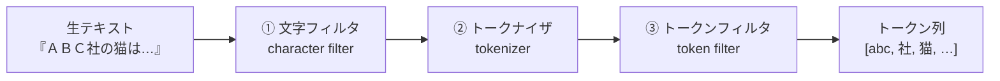

# フェーズ1 第4章：アナライザー — 日本語検索を支える形態素解析

> Elasticsearch学習教科書 — フェーズ1「Elasticsearch基礎」
> 前提知識：第1〜3章（特に第2章の環境、第3章の `text` 型）が済んでいること
> 付属ファイル：`phase1-04/Dockerfile`、`phase1-04/docker-compose.yml`

---

## この章で学ぶこと（学習目標）

この章を読み終えると、次のことができるようになります。

- **アナライザー**が「文字フィルタ → トークナイザ → トークンフィルタ」の3段構成であることを説明できる
- Dockerに **kuromojiプラグイン** を導入できる
- 標準アナライザーとkuromojiで、日本語の分割がどう変わるかを確認できる
- kuromojiが「賢い」理由（活用形の統一、助詞の除去など）を説明できる
- **形態素解析とN-gram** の違いと使い分けを理解する
- 日本語をきちんと検索できるインデックスを作れる

この章は、**日本語全文検索の品質を決める最重要章**です。第2章で「標準アナライザーは日本語を1文字ずつに割ってしまう」という問題を見ました。その正体を突き止め、解決します。

---

## 4.1 なぜ日本語には専用の仕組みが必要か

第1章で学んだとおり、全文検索はまず文章を**単語（トークン）に分割**して転置インデックスを作ります。英語は単語がスペースで区切られているので分割は簡単です。

```
"quick brown fox"  →  [quick] [brown] [fox]   ← スペースで切るだけ
```

ところが日本語には**単語の区切りがありません**。

```
"私は猫が好きです"  →  ？？？
```

どこで切ればいいのか、機械には自明ではありません。第2章で標準アナライザーに日本語を入れたとき、`私 / は / 猫 / が …` と**1文字ずつバラバラ**になったのは、日本語の区切りを理解できず、仕方なく1文字単位で切っていたためです。

これでは検索がうまくいきません。そこで登場するのが、**日本語の文を意味のある単語に分割する技術＝形態素解析（けいたいそかいせき）** です。Elasticsearchでは **kuromoji** というプラグインがこれを担います。

---

## 4.2 アナライザーの正体 — 3つの部品

まず、そもそも「アナライザー」とは何なのかを分解します。アナライザーは、次の**3つの部品が順番に並んだパイプライン**です。



### ① 文字フィルタ（character filter）
トークン化する**前**に、文字レベルで前処理をします。例：全角の「ＡＢＣ」を半角「ABC」に正規化する、HTMLタグを除去する、など。

### ② トークナイザ（tokenizer）
テキストを**単語（トークン）に分割**する、パイプラインの心臓部です。日本語ではここに **kuromoji_tokenizer** を使います。「どこで切るか」を決める最重要パーツです。

### ③ トークンフィルタ（token filter）
分割された**後**の各トークンを加工します。例：大文字を小文字に統一する、活用形を原形に戻す、助詞を捨てる、類義語を追加する、など。複数を順番に適用できます。

> 💡 第1章で「アナライザーが単語を分割・正規化する」とだけ説明したものを、ここで3部品に分解しました。**この3段構成を自分で組み替えることで、検索品質をチューニングできる**のが、Elasticsearchの強力なところです。

---

## 4.3 kuromojiプラグインを導入する

日本語を正しく分割するため、kuromojiプラグインをDocker環境に組み込みます。第2章の構成は公式イメージをそのまま使っていましたが、プラグイン入りの**独自イメージをビルド**する形に変更します。

### ステップ1：Dockerfile を用意する

作業フォルダに `Dockerfile`（拡張子なし）を作り、次の内容を保存します（付属の `phase1-04/Dockerfile` と同じです）。

```dockerfile
FROM docker.elastic.co/elasticsearch/elasticsearch:9.4.3

# 日本語の形態素解析プラグイン（kuromoji）
RUN bin/elasticsearch-plugin install --batch analysis-kuromoji

# 全角/半角などの正規化に使うプラグイン（icu_normalizer 用）
RUN bin/elasticsearch-plugin install --batch analysis-icu
```

`elasticsearch-plugin install` が、公式のプラグインを取ってきて組み込むコマンドです。`--batch` は確認プロンプトを自動でOKにするオプションです。

### ステップ2：docker-compose.yml を修正する

`docker-compose.yml` の elasticsearch サービスを、`image:` から `build: .` に変更します（Kibana側は変更不要）。付属の `phase1-04/docker-compose.yml` をそのまま使ってもOKです。

```yaml
  elasticsearch:
    build: .          # ← image: ... の行をこれに置き換える
    container_name: es01
    environment:
      - discovery.type=single-node
      - xpack.security.enabled=false
      - "ES_JAVA_OPTS=-Xms1g -Xmx1g"
    ports:
      - "9200:9200"
    ulimits:
      memlock:
        soft: -1
        hard: -1
```

### ステップ3：ビルドして起動する

`--build` を付けて起動すると、Dockerfileからプラグイン入りのイメージが作られます。

```bash
docker compose up -d --build
```

### ステップ4：プラグインが入ったか確認する

```bash
curl "http://localhost:9200/_cat/plugins?v"
```

`analysis-kuromoji` と `analysis-icu` が一覧に出れば成功です。

> ⚠️ 既に第2〜3章で環境を動かしていた場合は、いちど `docker compose down` してから、上記の新しい構成で `up -d --build` し直してください。

---

## 4.4 標準 vs kuromoji — 分割を見比べる

準備ができたので、第2章と同じ `_analyze` で違いを体感します。Kibana Dev Tools で実行してください。

### 標準アナライザー（おさらい）

```
POST /_analyze
{
  "analyzer": "standard",
  "text": "私は猫が好きです"
}
```

→ `私 / は / 猫 / が / 好 / き / で / す` のように、**ほぼ1文字ずつ**に割れてしまいます。

### kuromojiアナライザー

```
POST /_analyze
{
  "analyzer": "kuromoji",
  "text": "私は猫が好きです"
}
```

→ おおよそ `私 / 猫 / 好き` のように、**意味のある単語**に分割されます。しかも、助詞の「は」「が」や助動詞の「です」が消えているはずです。これは偶然ではなく、kuromojiが賢く処理した結果です（次節で解説）。

この「意味の単位で切れる」ことが、日本語検索の品質を根本から変えます。

---

## 4.5 kuromojiアナライザーが「賢い」理由

Elasticsearchに標準で用意されている `kuromoji` アナライザーは、実は**トークナイザ＋複数のトークンフィルタ**が組まれた便利セットです。中身は、おおまかに次の処理を順番に行っています。

| 処理 | 役割 | 例 |
|------|------|-----|
| 文字幅の正規化 | 全角/半角などをそろえる | `ｱ` → `ア` |
| kuromoji_tokenizer | 単語に分割 | 私は猫が → 私 / は / 猫 / が |
| baseform（原形化） | 活用形を原形に戻す | 「走った」→「走る」 |
| 品詞フィルタ | 助詞・助動詞などを除去 | 「は」「が」「です」を捨てる |
| 日本語ストップワード | ありふれた語を除去 | 「これ」「それ」など |
| stemmer（長音処理） | 語尾の長音を整理 | 「サーバー」→「サーバ」 |
| 小文字化 | 英字を小文字に統一 | `PC` → `pc` |

特に効果が大きいのが **原形化** と **品詞フィルタ** です。

- **原形化**のおかげで、「走る」で検索したときに「走った」「走ります」を含む文書もヒットします（活用の違いを吸収）。
- **品詞フィルタ**のおかげで、検索に不要な助詞（は・が・を）が索引から除かれ、ノイズが減ります。

第1章で「全文検索エンジンは索引を作る段階で正規化するから賢い」と学びました。日本語では、この正規化を担っているのがまさにkuromojiのフィルタ群なのです。

---

## 4.6 トークナイザのモード — 複合語の扱い

kuromojiのトークナイザには、複合語（いくつかの語がくっついた語）をどう扱うかの **モード** があります。代表例として「関西国際空港」を見てみましょう。

- **normal（通常）**：複合語を分解しない → `[関西国際空港]`（まるごと1語）
- **search（検索向け）**：複合語を分解し、部分と全体の両方を出す → `[関西, 関西国際空港, 国際, 空港]`
- **extended（拡張）**：searchに加え、未知語を1文字ずつにも分解する

検索用途では **search モード** が便利です。「関西国際空港」でも「空港」でもヒットさせられるからです。実際に確認してみましょう。

```
POST /_analyze
{
  "tokenizer": { "type": "kuromoji_tokenizer", "mode": "search" },
  "text": "関西国際空港"
}
```

→ 「関西」「国際」「空港」などに分解され、部分語での検索に対応できます。

---

## 4.7 形態素解析 vs N-gram — 2つのアプローチ

日本語の分割には、実は**2つの流派**があります。kuromojiの**形態素解析**と、もう一つの**N-gram**です。両方の長所短所を知っておくと、検索設計の幅が広がります。

### N-gram とは

N-gramは、意味を考えず**機械的にN文字ずつ**区切る方法です。2文字ずつなら「bi-gram（バイグラム）」と呼びます。

```
「東京都」を bi-gram で分割:
  東京 / 京都 / 都
```

### 決定的な違い：「京都」で「東京都」がヒットするか

この2つの差が最もはっきり出るのが、次の例です。

- **形態素解析（kuromoji）**：「東京都」→ `[東京, 都]`。「京都」という単語は生まれない
  → 「京都」で検索しても「東京都」は**ヒットしない**（＝正確、ノイズが少ない）
- **N-gram（bi-gram）**：「東京都」→ `[東京, 京都, 都]`。「京都」が索引に含まれる
  → 「京都」で検索すると「東京都」が**ヒットしてしまう**（＝取りこぼしは少ないが誤ヒットが出る）

### 長所と短所のまとめ

| | 形態素解析（kuromoji） | N-gram |
|--|------------------------|--------|
| 分割の考え方 | 意味の単位で切る | N文字ずつ機械的に切る |
| 精度（ノイズの少なさ） | 高い（誤ヒットが少ない） | 低い（誤ヒットが出やすい） |
| 網羅性（取りこぼしの少なさ） | 辞書にない語は苦手 | 高い（どんな語も拾える） |
| 新語・固有名詞 | 辞書更新が必要 | 得意 |
| 索引サイズ | 小さめ | 大きくなりがち |

### どちらを使うか

一般的には、**まず形態素解析（kuromoji）を主軸**にするのがおすすめです。日本語として自然で、検索結果のノイズが少ないからです。そのうえで「取りこぼしを減らしたい」「新語や型番も拾いたい」という要件があれば、**マルチフィールド（第3章）で kuromoji版とN-gram版の両方を持たせて併用**する、という設計がよく使われます。

> 💡 第3章のマルチフィールドが、ここで効いてきます。1つの `title` に対して、`title`（kuromojiで精度重視）と `title.ngram`（N-gramで網羅重視）を持たせ、検索時に両方を狙う、といった合わせ技が可能です。

---

## 4.8 実践 — 日本語検索できるインデックスを作る

いよいよ、日本語をきちんと検索できるインデックスを作ります。2通り示します。

### 方法A：手軽に — 組み込みの `kuromoji` アナライザーを使う

`text` フィールドに `analyzer` を指定するだけです。

```
PUT /articles-ja
{
  "mappings": {
    "properties": {
      "title": { "type": "text", "analyzer": "kuromoji" }
    }
  }
}
```

文書を登録して検索してみます。

```
PUT /articles-ja/_doc/1
{ "title": "猫の飼い方の基本" }

PUT /articles-ja/_doc/2
{ "title": "犬と暮らすための準備" }
```

```
GET /articles-ja/_search
{
  "query": { "match": { "title": "猫" } }
}
```

→ 文書1がヒットします。「猫の飼い方」が `猫 / 飼う / 方` のように分割されているため、「猫」で正しく引き当てられます。第2章の1文字分割では実現しにくかった、自然な日本語検索ができています。

### 方法B：本格的に — カスタムアナライザーを組む

実務では、モードや正規化を自分で調整するために、3部品を明示的に組んだ**カスタムアナライザー**を定義します。これが第4章の集大成です。

```
PUT /articles-ja-custom
{
  "settings": {
    "analysis": {
      "char_filter": {
        "normalize": { "type": "icu_normalizer" }
      },
      "tokenizer": {
        "ja_tokenizer": {
          "type": "kuromoji_tokenizer",
          "mode": "search"
        }
      },
      "analyzer": {
        "ja_analyzer": {
          "type": "custom",
          "char_filter": ["normalize"],
          "tokenizer": "ja_tokenizer",
          "filter": [
            "kuromoji_baseform",
            "kuromoji_part_of_speech",
            "ja_stop",
            "kuromoji_stemmer",
            "lowercase"
          ]
        }
      }
    }
  },
  "mappings": {
    "properties": {
      "title": { "type": "text", "analyzer": "ja_analyzer" }
    }
  }
}
```

この定義は、4.2で学んだ「文字フィルタ → トークナイザ → トークンフィルタ」の3段構成をそのまま書き下したものです。

- `char_filter`：`icu_normalizer` で全角/半角などを正規化（4.3でicuプラグインを入れたのはこのため）
- `tokenizer`：`kuromoji_tokenizer` を **search モード** で使い、複合語に対応
- `filter`：原形化・品詞除去・ストップワード・長音処理・小文字化を順に適用

自作アナライザーの動きは、インデックスを指定して `_analyze` で確認できます。

```
POST /articles-ja-custom/_analyze
{
  "analyzer": "ja_analyzer",
  "text": "東京都でサーバーを走らせた"
}
```

原形化（走らせた→走る）や長音処理（サーバー→サーバ）が効いた結果が見られるはずです。

---

## 4.9 実務でさらに効くもの（次章以降の予告）

日本語検索を突き詰めると、次のような要素も重要になります。詳しくはフェーズ2の「検索の改善」で扱いますが、存在だけ知っておきましょう。

- **ユーザー辞書（user_dictionary）**：kuromojiの辞書にない固有名詞や社内用語（商品名・型番など）を、正しく1語として認識させる
- **シノニム（類義語）**：「PC」と「パソコン」、「スマホ」と「スマートフォン」を同じものとして扱う
- **表記ゆれ対応**：ひらがな/カタカナ、送り仮名の揺れなどの吸収

これらはすべて、4.2で学んだ**3部品の組み替え**で実現します。アナライザーの構造を理解した今なら、どこに何を足せばよいかがイメージできるはずです。

---

## 4.10 まとめ

- 日本語は単語の区切りがないため、**形態素解析（kuromoji）** で意味の単位に分割する必要がある
- アナライザーは **文字フィルタ → トークナイザ → トークンフィルタ** の3段パイプライン
- kuromojiはDockerに **プラグインとして導入**（`elasticsearch-plugin install analysis-kuromoji`）
- 組み込みの `kuromoji` アナライザーは、原形化・品詞除去などを含む賢い便利セット
- トークナイザの **search モード** は複合語（関西国際空港→空港…）に強い
- **形態素解析＝精度重視／N-gram＝網羅重視**。マルチフィールドで併用もできる
- カスタムアナライザーで、3部品を自由に組んで検索品質をチューニングできる

日本語検索の土台がこれで完成しました。

---

## 4.11 理解度チェック

**問1.** アナライザーを構成する3つの部品を、処理される順に挙げてください。

**問2.** 標準アナライザーで日本語がうまく分割できないのはなぜですか。それを解決するのが何ですか。

**問3.** 「京都」で検索したときに「東京都」がヒットしてしまうのは、形態素解析とN-gramのどちらの特徴ですか。理由も述べてください。

**問4.** kuromojiアナライザーの「原形化（baseform）」があると、検索においてどんな利点がありますか。具体例で説明してください。

<details>
<summary>解答を見る</summary>

**問1.** ① 文字フィルタ（character filter）→ ② トークナイザ（tokenizer）→ ③ トークンフィルタ（token filter）。

**問2.** 日本語は単語がスペースで区切られておらず、標準アナライザーは日本語の語の区切りを理解できないため（結果として1文字ずつに割れる）。解決するのは、形態素解析を行う kuromoji プラグイン。

**問3.** N-gram の特徴。N-gram（bi-gram）は「東京都」を意味を無視して2文字ずつ `東京 / 京都 / 都` と切るため、「京都」というトークンが生まれ、誤ってヒットする。形態素解析は意味の単位で `東京 / 都` と切るので「京都」は生まれず、ヒットしない。

**問4.** 活用形の違いを吸収できる。例：「走る」で検索したとき、「走った」「走ります」も原形の「走る」に統一されて索引されているため、まとめてヒットさせられる。

</details>

---

## 次の章へ

日本語を正しく索引できるようになりました。次章では、いよいよ**データを実際に操作するAPI**を体系的に学びます。ドキュメントの登録・取得・更新・削除（CRUD）と、大量データを一気に投入する **Bulk API** を扱い、検索を試すためのデータを自分で用意できるようにします。

> **次章：フェーズ1 第5章「CRUD操作とBulk API — データを登録・更新・削除する」**

---

### この章のキーワード

アナライザー / 文字フィルタ / トークナイザ / トークンフィルタ / 形態素解析 / kuromoji / analysis-kuromoji / analysis-icu / baseform（原形化）/ 品詞フィルタ / search モード / N-gram / bi-gram / icu_normalizer / カスタムアナライザー / ユーザー辞書
